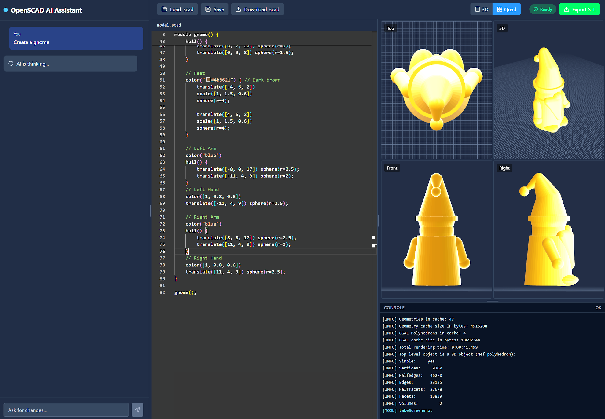

<h1>SCADTron</h1>

An AI-powered, browser-native 3D modeling tool powered by OpenSCAD and Manifold geometry.

## Overview
SCADTron is a unified environment for writing, generating, and rendering 3D parametric models. It uses a high-performance WebAssembly build of OpenSCAD combined with the Manifold geometry engine, allowing it to render complex booleans lightning-fast entirely in your browser without any server-side compilation.

## Features
- **AI-Powered Code Generation:** An embedded AI assistant specifically prompted and equipped with Google Search fallback documentation to generate and debug OpenSCAD scripts for you.
- **Lightning Fast WASM Backend:** Powered by `openscad-playground` WASM utilizing the experimental 2025 Manifold kernel for 10-100x faster CSG geometry calculations over traditional CGAL.
- **Quad-Viewport Rendering:** View your models in dynamic hardware-accelerated Top, Front, Right, and 3D Perspective formats using Three.js and React-Three-Fiber.
- **Parametric GUI:** Automatically extracts parameters from standard OpenSCAD comments (`// [10:1:50] Width of the base`) and provides visual sliders/checkboxes to adjust the model effortlessly.
- **Robust Error Catching:** Intercepts console logs to instantly identify mathematically invalid geometry (`2-manifold geometry errors`) natively alongside code.

## Run Locally

**Prerequisites:** Node.js

1. Install dependencies:
   `npm install`
2. Set the `GEMINI_API_KEY` in `.env.local` to your Gemini API key (Required for the AI coding assistant)
3. Run the app:
   `npm run dev`

*(Note: Ensure you place your application screenshot as `screenshot.png` in the `public/` directory for it to show up on the repo page!)*
